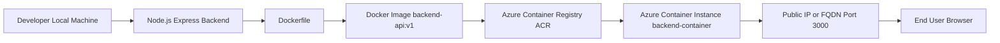

# Dockerized Node.js Backend with Azure Container Registry

This project demonstrates how to containerize a simple Node.js backend application using Docker, push the Docker image to Azure Container Registry (ACR), and deploy it using Azure Container Instances (ACI).

---

## Project Overview

The application is a basic Node.js Express backend API. The application is packaged into a Docker image, stored securely in Azure Container Registry, and deployed as a containerized application on Azure Container Instances.

---

## Architecture Diagram



---

## Architecture Flow

1. Create a backend application using Node.js and Express.
2. Create a Dockerfile to containerize the application.
3. Build the Docker image locally using Docker.
4. Tag the image with the Azure Container Registry login server.
5. Push the image to Azure Container Registry (ACR).
6. Deploy the image from ACR to Azure Container Instances (ACI).
7. Expose the application using a Public IP or FQDN.
8. Access the application from a browser.

---

## Features

- Node.js Express Backend API
- Dockerized Application
- Azure Container Registry Integration
- Azure Container Instance Deployment
- Public Access using FQDN/IP
- Cloud Native Container Deployment

---

## Tech Stack

- Node.js
- Express.js
- Docker
- Azure Container Registry (ACR)
- Azure Container Instances (ACI)
- Azure Cloud Shell
- Azure Portal

---

## Project Structure

```text
DockerProject/
│
├── server.js
├── package.json
├── package-lock.json
├── Dockerfile
├── .dockerignore
└── README.md
```

---

## Application Code

### server.js

```javascript
const express = require('express');
const app = express();

app.get('/', (req, res) => {
    res.send('Hello from Docker Container!');
});

const PORT = 3000;

app.listen(PORT, () => {
    console.log(`Server running on port ${PORT}`);
});
```

---

## Dockerfile

```dockerfile
FROM node:18-alpine

WORKDIR /app

COPY package*.json ./

RUN npm install

COPY . *

EXPOSE 3000

CMD ["node", "server.js"]
```

---

## .dockerignore

*``text
node_modules
npm-debug.log
*git
.gitignore
```

---

## Prereq*isites

- Azure Subscription
- Doc*er Desktop
- Visual Studio Code
- *zure Container Registry
- Azure Cl*ud Shell

---

## Run Application *ocally

### Install Dependencies

*``bash
npm install
```

### Run Ap*lication

```bash
node server.js
`*`

Open:

```text
http://localhost:3000
```

Expected Output:

```tex*
Hello from Docker Container!
```
*---

## Docker Commands

### Build*Docker Image

```bash
docker build*-t backend-api:v1 .
```

### Verif* Docker Image

```bash
docker imag*s
```

### Run Container

```bash
*ocker run -d -p 3000:3000 backend-*pi:v1
```

### List Running Contai*ers

```bash
docker ps
```

### St*p Container

```bash
docker stop <*ontainer-id>
```

### Remove Conta*ner

```bash
docker rm <container-*d>
```

---

## Azure Container Re*istry

### Tag Docker Image

```ba*h
docker tag backend-api:v1 labmyd*cker.azurecr.io/backend-api:v1
```*
### Login to ACR

```bash
docker *ogin labmydocker.azurecr.io
```

#*# Push Image to ACR

```bash
docke* push labmydocker.azurecr.io/backe*d-api:v1
```

### Verify Repositor*

```bash
az acr repository list \*--name labmydocker \
--output tabl*
```

---

## Azure Container Inst*nce Deployment

```bash
az contain*r create \
  --resource-group Test*group \
  --name backend-container*\
  --image labmydocker.azurecr.io*backend-api:v1 \
  --registry-logi*-server labmydocker.azurecr.io \
 *--registry-username labmydocker \
* --registry-password '<ACR_PASSWOR*>' \
  --ip-address Public \
  --p*rts 3000 \
  --os-type Linux \
  -*cpu 1 \
  --memory 1.5
```

---

#* Verify Deployment

### Check Cont*iner Status

```bash
az container *how \
--resource-group Test-group *
--name backend-container \
--outp*t table
```

### Get Public IP

``*bash
az container show \
--resourc*-group Test-group \
--name backend*container \
--query ipAddress.ip \*-o tsv
```

### Get FQDN

```bash
*z container show \
--resource-grou* Test-group \
--name backend-conta*ner \
--query ipAddress.fqdn \
-o *sv
```

---

## Application Access*
Open in browser:

```text
http://*public-ip>:3000
```

OR

```text
h*tp://<fqdn>:3000
```

Expected Out*ut:

```text
Hello from Docker Con*ainer!
```

---

## Project Workfl*w

```text
Node.js Backend
       *
       ▼
Docker Build
       │
  *    ▼
Docker Image
       │
      *▼
Azure Container Registry
       *
       ▼
Azure Container Instance*       │
       ▼
Public URL
     * │
       ▼
End User Access
```

-*-

## Learning Outcomes

- Created*a REST API using Node.js and Expre*s.
- Built and tested a Docker ima*e locally.
- Containerized an appl*cation using Docker.
- Pushed Dock*r images to Azure Container Regist*y.
- Deployed containerized applic*tions using Azure Container Instan*es.
- Exposed containers through P*blic IP/FQDN.
- Learned Azure cont*iner services and deployment workf*ow.

---

## Challenges Faced and *esolutions

### Docker Build Conte*t Error

Issue:

```bash
docker bu*ld -t backend-api:v1
```

Resoluti*n:

```bash
docker build -t backen*-api:v1 .
```

---

### Azure CLI *ot Found

Issue:

```bash
az : com*and not found
```

Resolution:

Us*d Azure Cloud Shell instead of loc*l Azure CLI.

---

### ACR Login S*rver Error

Issue:

```text
azurea*r.io
```

Resolution:

Correct Log*n Server:

```text
azurecr.io
```
*---

### Invalid OSType Error

Iss*e:

```text
The osType for contain*r group is invalid.
```

Resolutio*:

```bash
--os-type Linux
```

--*

### CPU and Memory Not Specified*
Issue:

```text
ResourceRequestsN*tSpecified
```

Resolution:

```ba*h
--cpu 1 --memory 1.5
```

---

#* Future Enhancements

- CI/CD Pipe*ine using GitHub Actions
- Azure DevOps Integration
- Azure Kubernetes Service (AKS) Deployment
- Health Check Endpoint
- Application Monitoring using Azure Monitor
- Scaling using Kubernetes
- Secrets Management using Azure Key Vault

---

## Author

**Neha Methwani**

### Project

Dockerized Backend Application using Docker, Azure Container Registry (ACR), and Azure Container Instances (ACI).
